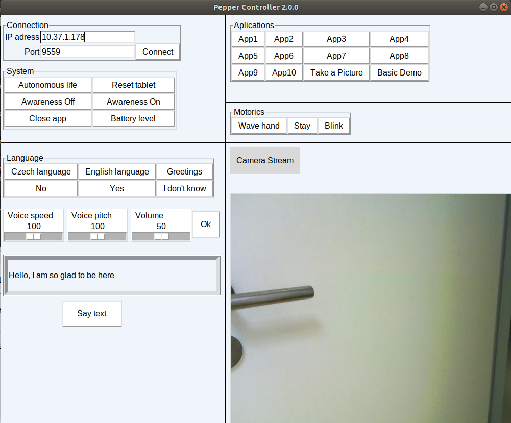

# GUI for communication with humanoid robot Pepper

Pepper-gui is a graphical user interface that allows controlling humanoid robot Pepper.

## Installation

Pepper SDK 2.5.10 library for Python 2.7 (imported as qi or naoqi). \

It can be installed from:https://www.softbankrobotics.com/emea/en/support/pepper-naoqi-2-9/downloads-softwares \

Also, if you have Linux, add the path to qi in your .bashrc: export PYTHONPATH=${PYTHONPATH}:/home/yourusername/pynaoqi/lib/python2.7/site-packages 

Then install all the other requirements using: pip2 install -r ./requirements.txt 

## Usage

Enter Pepper's IP address and press "Připojit". You will be connected to your local robot. \

Then you can start the application by clicking the button with it's name in the section "Aplikace". Most of them are in choreogrpahe and in 90% of the time it is not possible to launch them. 

In order to choose the language in which Pepper speaks (Czech or English) you should press "Nastav češtinu/angličtinu" \

If you want Pepper to say the phrase chosen by you enter it in the field above "řict text" button and then press it.

As you can see, everything is pretty intuitive (if you know the Czech language).