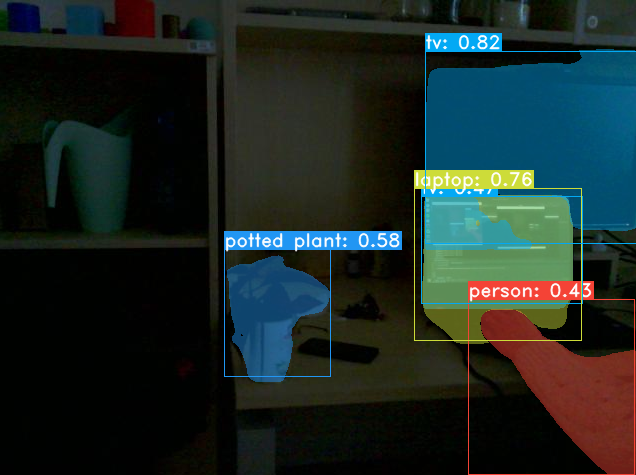

# Running YOLACT network on Pepper

This will show Pepper's camera in OpenCV, detect objects and Pepper will say out loud what he sees.

## Requirements

- install conda environment:
`conda env create -f pepper_yolact/environment.yml`

`conda activate ciircgym`

`python setup.py develop`

## How to run

- In "yolactDemo.py", change the IP address of your Pepper robot

- If you want to choose the mode of speaking (i.g Pepper answering questions), change "subprocess.run(["python2", fileName, '--speak_constantly=True'])" to "subprocess.run(["python2", fileName, '--speak_constantly=False'])"

`cd pepper_yolact`

`python pepper_yo.py`

